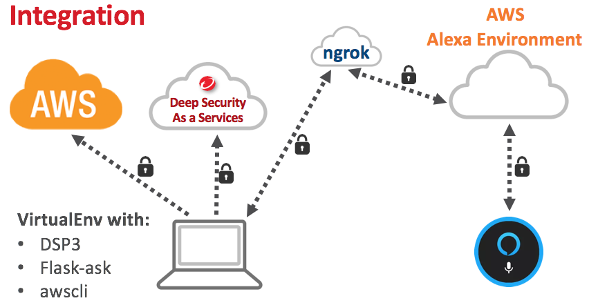

Voice Control Security Automation
===




A Python 3 integration using Falsk-ask to integrate with Deep Security Web API's, Alexa, and AWScli.

>NOTE: This is a very initial commit and not recommended for use in production environment yet.


# Creating Alexa Lab – (Flask-ask Install)

### Create a [virtualenv] to install [Flask-ask]

```sh
$ virtualenv -p python3 --no-site-packages AlexaLab
$ . AlexaLab/bin/activate
```
### Following process on the link below to create a Flask Environment, Alexa Skill and Install ngrok

- [Flask-ask: Alexa Skills Kit Development]

`OBS:. Before to go to the next steps make sure Flask-ask and Alexa Skill it’s working properly. You will need an Alexa Dot or Tap to complete this first step.`


# Creating Alexa Lab - (DSP3 Install)

### Install [DSP3] inside the virtualenv AlexaLab

* Check if the virtualenv have these following requirements installed:
```sh
  suds-py3 >= 1.2.0.0
  requests >= 2.9.1
```
`OBS:. If not, install using pip install.`

* Install DSP3 inside virtualenv

```sh
  $ pip install -i https://testpypi.python.org/pypi dsp3
```


[//]: # (External Links)
[virtualenv]:https://virtualenv.pypa.io/en/stable/
[Flask-ask]:https://github.com/johnwheeler/flask-ask
[Flask-ask: Alexa Skills Kit Development]:https://developer.amazon.com/blogs/post/Tx14R0IYYGH3SKT/flask-ask-a-new-python-framework-for-rapid-alexa-skills-kit-development
[DSP3]:http://dsp3.readthedocs.io/en/latest/
